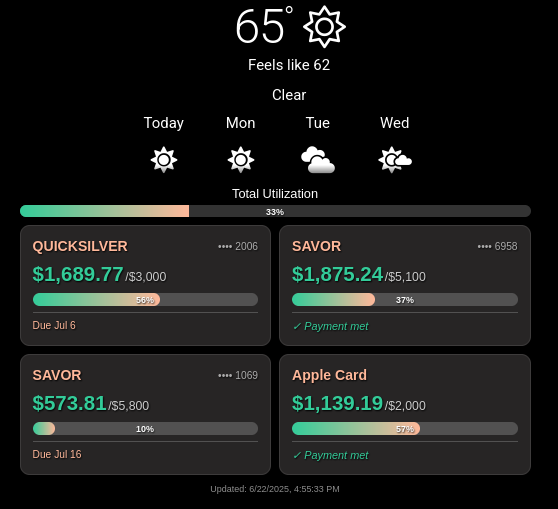
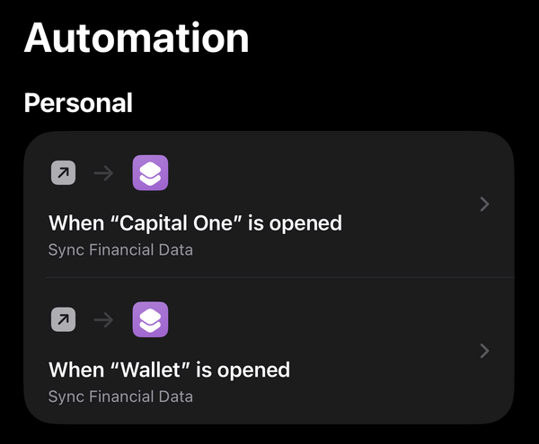
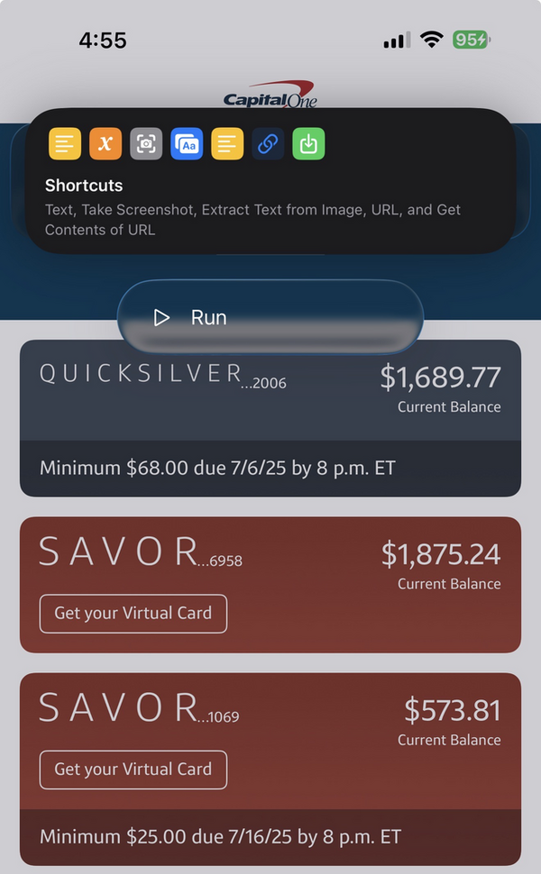
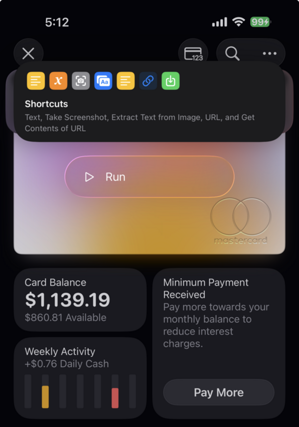

# 📱💳 iOS Banking Dashboard Automation

**Sync your credit card balances from Capital One and Apple Card to any dashboard in seconds using iOS Shortcuts automation.**



## ✨ What This Does

Transform manual balance checking into automatic dashboard updates:

1. **📱 Open Banking App** → iOS detects and runs automation
2. **🤖 Data Extraction** → Shortcuts captures account data 
3. **📊 Dashboard Update** → Your display refreshes instantly

**No credentials stored. No web scraping. Just iOS automation magic.**

**🚀 [Quick Start Guide](docs/QUICK_START.md) | 📚 [Technical Docs](docs/TECHNICAL.md)**

---

## 🚀 Complete Setup Guide

### Step 1: Install the iOS Shortcut Template

Download and install the pre-configured Shortcut template:

**📥 [Install iOS Shortcut Template](https://www.icloud.com/shortcuts/82a807520ded4db7b5d06b26fe71cfc8)**


The template includes:
- ✅ Text extraction from banking apps
- ✅ Data parsing for Capital One & Apple Card
- ✅ API endpoint configuration
- ✅ Screenshot OCR fallback

### Step 2: Configure Automation Triggers

Set up automatic triggers for your banking apps:



Create automations for:
- **Capital One app** - Triggers when app opens
- **Wallet app** - Triggers when app opens
- **Manual trigger** - Run anytime from Shortcuts

### Step 3: Deploy the API Server

**Quick Docker Setup:**
```bash
git clone <your-repo>
cd bank-scraper-api
cp env.template .env
# Edit .env with your API key
docker-compose up -d
```

**Manual Setup:**
```bash
npm install
export API_KEY=your-secret-key
export PORT=3000
npm start
```

### Step 4: Update Shortcut Configuration

In your iOS Shortcut, update the **"Text"** action with your server URL:
```
https://your-server.com/update-balances
```

---

## 📱 Using the Automation

### Capital One Usage

1. **Open Capital One app**
2. **Wait for automation prompt** (may take 2-3 seconds)
3. **Tap "Run"** when prompted



**⚠️ Timing Note:** If you're not logged in, the automation prompt may disappear before you log in. Simply close and relaunch the app, then tap "Run".

### Apple Card Usage

1. **Open Wallet app**
2. **Tap Apple Card**
3. **Wait for automation prompt**
4. **Tap "Run"** when prompted



**⚠️ Same timing caveat applies** - relaunch if the prompt disappears too quickly.

---

## 🎛️ Dashboard Integration

### Dakboard Widget

Use the included `examples/dakboard-widget.html` for a ready-to-use credit card dashboard:

**Features:**
- 💳 Multiple credit cards in grid layout
- 📊 Utilization bars with percentages
- 💰 Balance/Limit display (e.g., `$300/$1200`)
- 🎯 Total utilization tracking
- ⏰ Auto-refresh every 10 minutes

**Setup:**
1. Upload `examples/dakboard-widget.html` to your web server
2. Update API URL and key in the HTML
3. Add as Custom HTML block in Dakboard

### Other Dashboards

The API returns standard JSON that works with any dashboard:

```javascript
// Example API response
{
  "success": true,
  "accounts": [
    {
      "name": "QUICKSILVER",
      "balance": 1689.77,
      "availableCredit": 3000,
      "type": "credit_card"
    }
  ],
  "lastUpdated": "2024-06-22T21:30:00.000Z"
}
```

---

## 🔧 API Endpoints

| Endpoint | Method | Purpose |
|----------|--------|---------|
| `/update-balances` | POST | Receive data from iOS Shortcut |
| `/balance?key=API_KEY` | GET | Dashboard data retrieval |
| `/health` | GET | Health check |
| `/status` | GET | Current data status |

---

## 🛡️ Security & Privacy

- ✅ **No banking credentials stored**
- ✅ **Data processed locally on your server**
- ✅ **Manual control - you trigger updates**
- ✅ **API key protection**
- ✅ **No web scraping or ToS violations**

---

## 📱 Android Alternative

While this guide focuses on iOS, the concept works on Android too:

- **Tasker** - Create similar automations
- **MacroDroid** - App-triggered shortcuts
- **Manual** - Use included clipboard scripts (`examples/send-clipboard.sh` or `examples/send-clipboard.py`)

---

## 🛠️ Supported Banks

### ✅ Currently Supported
- **Capital One** (All card types: Quicksilver, Savor, Venture, etc.)
- **Apple Card** (via Wallet app)

### 🔄 Adding More Banks
The text parsing system can be extended for other banks. Check `server.js` for parsing logic examples.

---

## 🚨 Troubleshooting

**Automation not triggering:**
- Check iOS Settings → Shortcuts → Advanced → Allow Running Scripts
- Verify automation is enabled in Shortcuts app

**Data not updating:**
- Check API server logs: `docker logs <container-name>`
- Verify API key in shortcut matches server
- Test with manual POST: `curl -X POST your-server/update-balances -d "test"`

**Timing issues:**
- Banking apps need to be fully loaded before automation runs
- Close and reopen app if prompt disappears too quickly

---

## 💡 Why This Approach?

| Traditional Methods | This Solution |
|-------------------|---------------|
| 💰 Expensive APIs (Plaid: $0.25/account) | 🆓 Free after initial setup |
| 🔐 Store banking credentials | 🛡️ Zero credentials needed |
| 🕷️ Web scraping (ToS violations) | ✅ Manual, compliant process |
| 🤖 Complex 2FA handling | 📱 You handle login naturally |
| ⏰ Scheduled scraping delays | ⚡ Instant updates on demand |

---

## 📄 License

MIT License - Use freely for personal or commercial projects.

---

**🎯 Result: Turn your phone into a banking data pipeline with zero security compromise.**
